```{r setup, include=FALSE}
knitr::opts_chunk$set(echo = TRUE)
```

## Austin, Texas

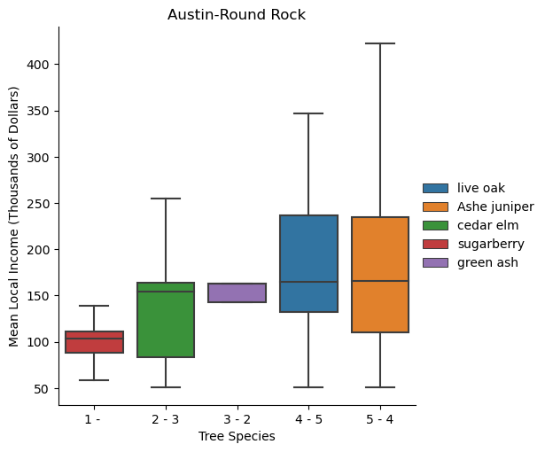
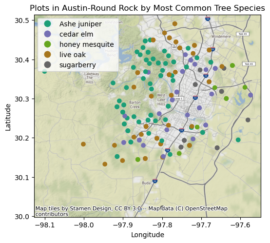


## Chicago, Illinois

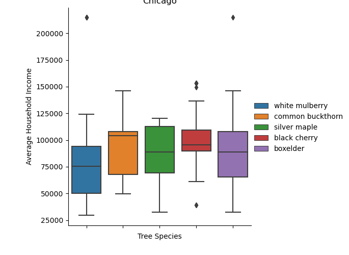
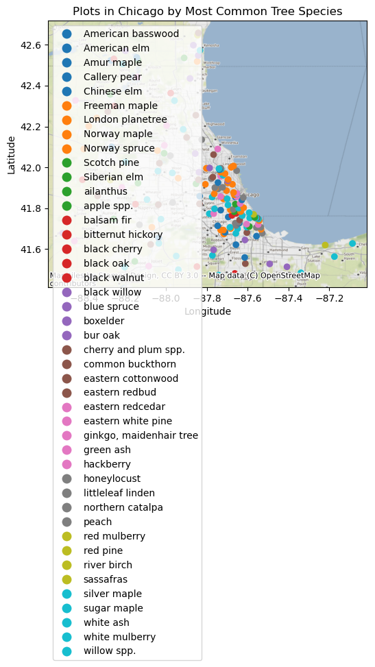

## Houston, Texas

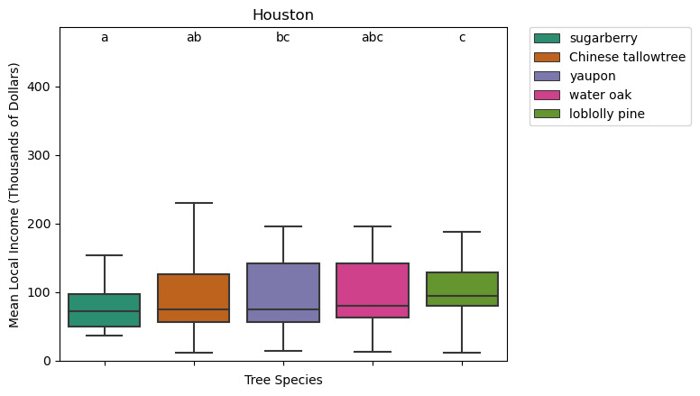
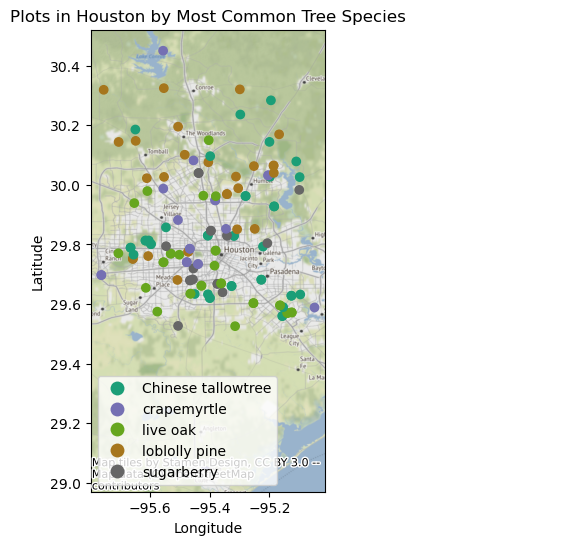

## Kansas City, Missouri

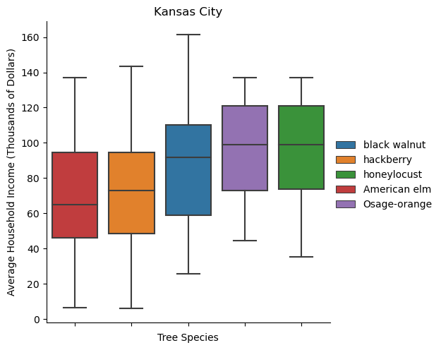
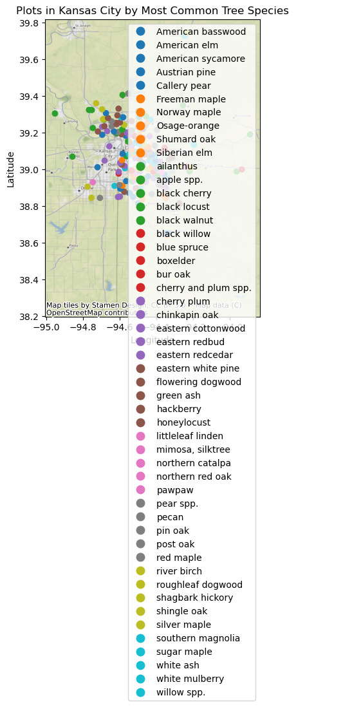

## Portland, Oregon

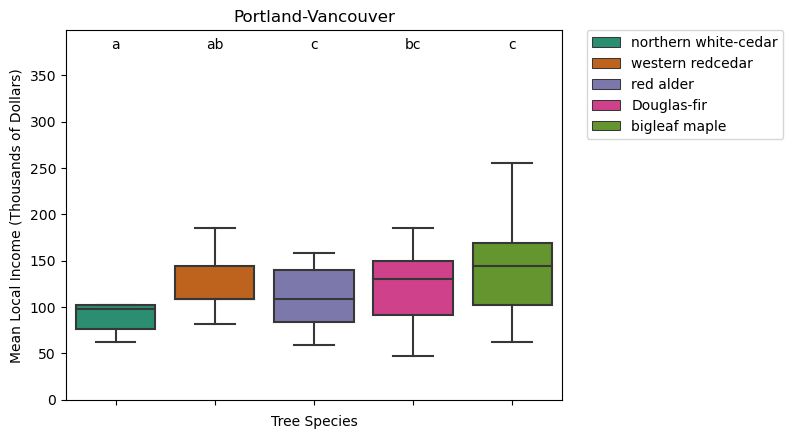
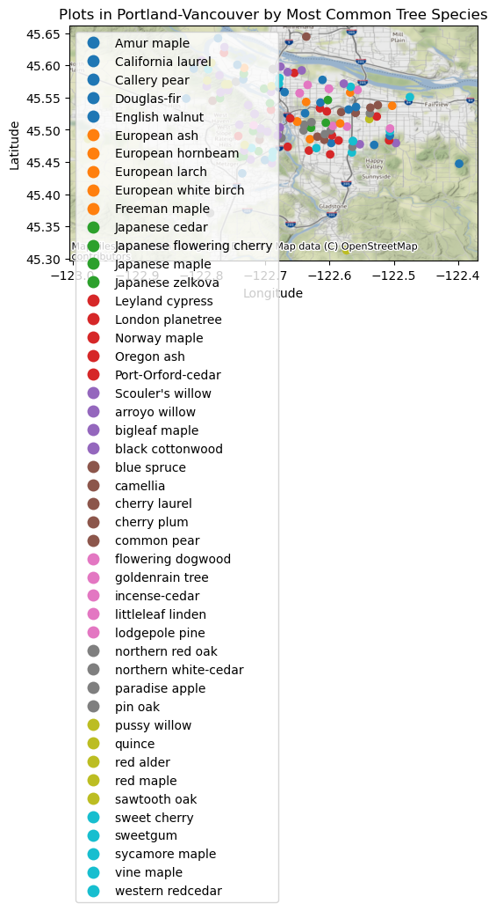

## San Antonio, Texas

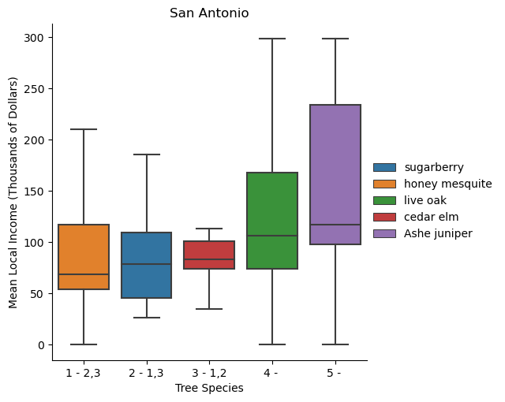
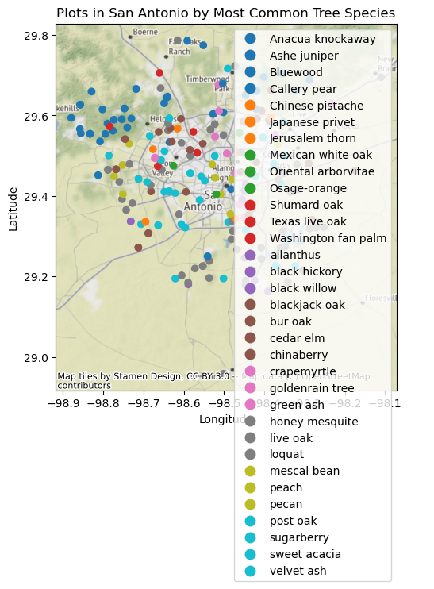

## San Diego, California

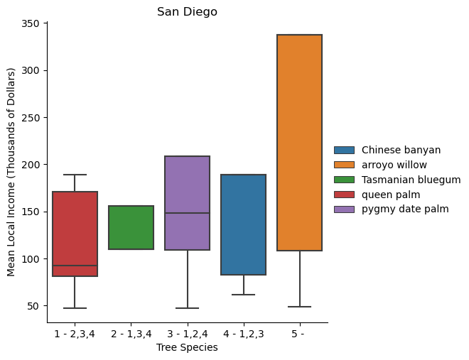
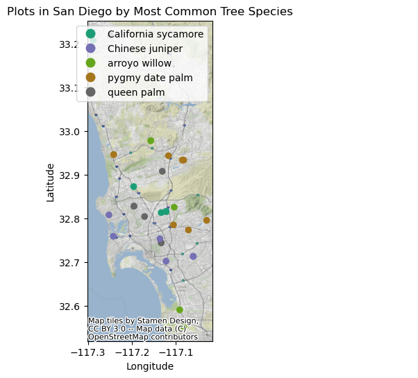

## Springfield, Missouri

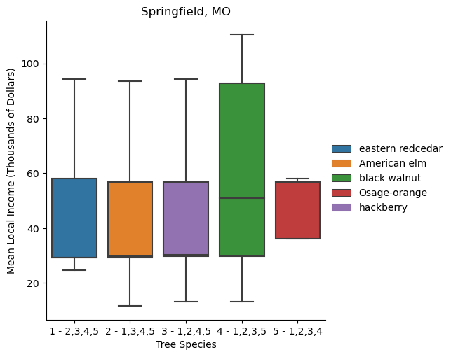
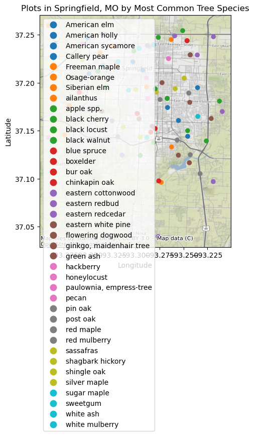

## Saint Louis, Missouri

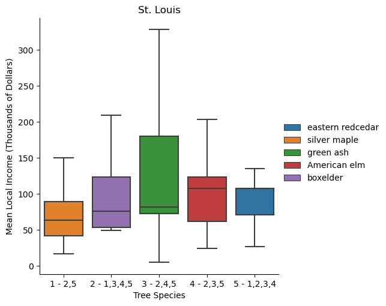


## Washington D.C

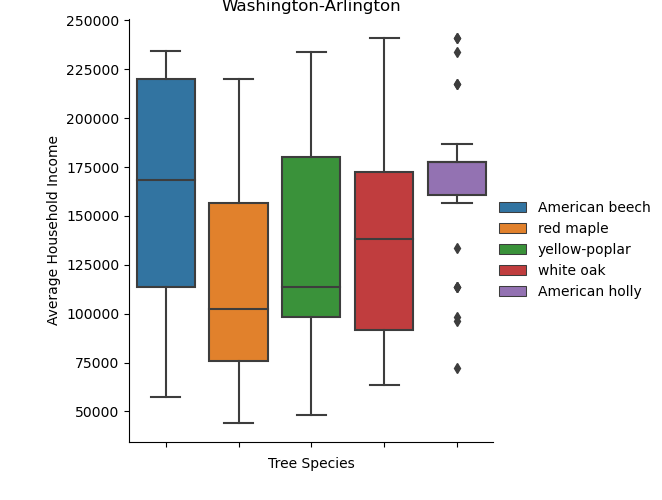
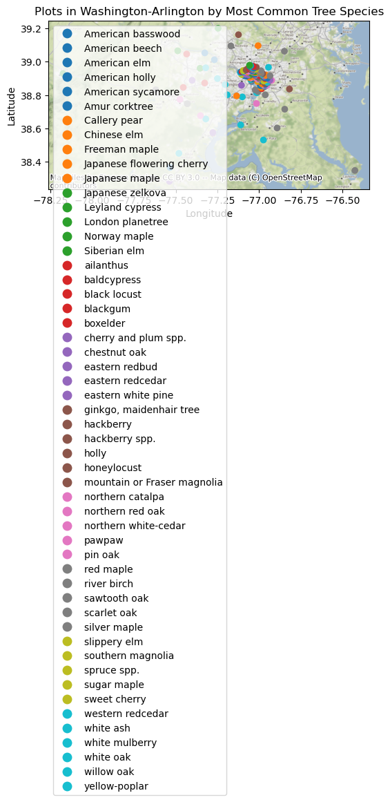


